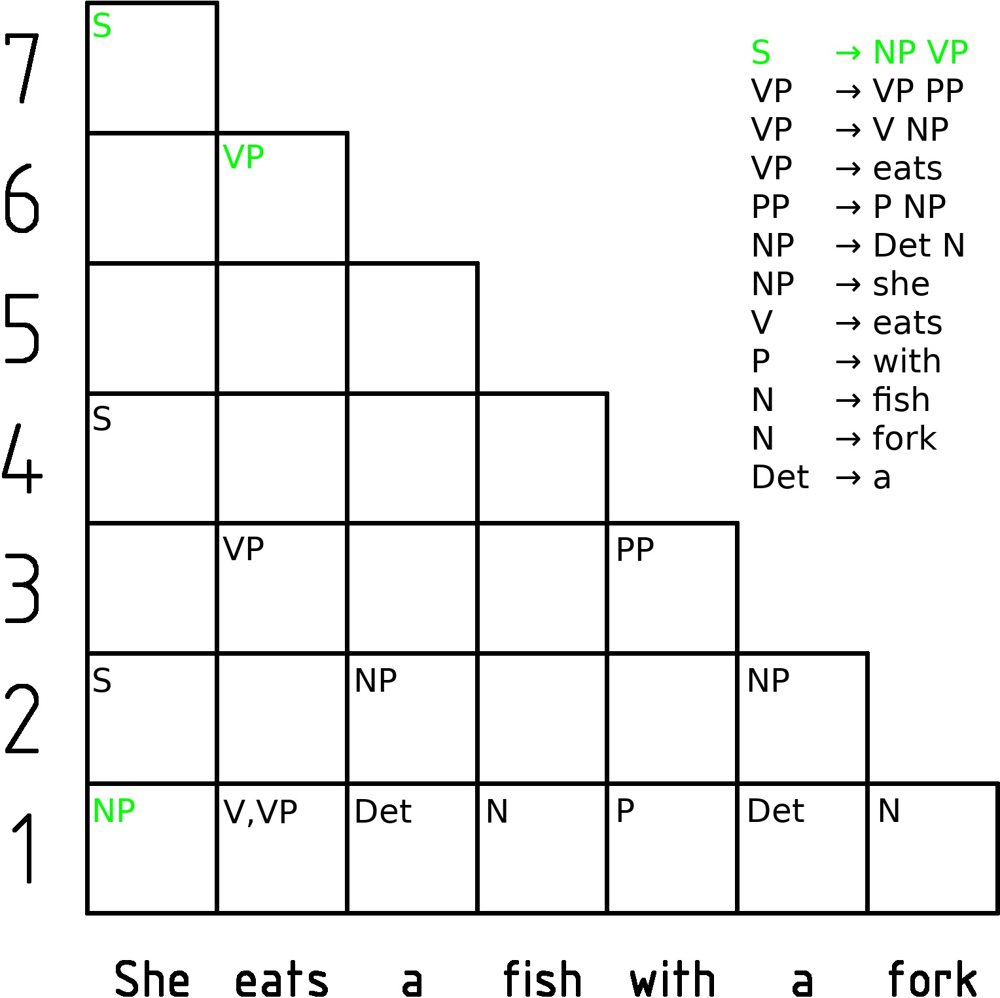

## Formale Sprachen
------------------

### Definition
1. Ein endliches **Alphabet Σ** ist eine endliche Menge von Symbolen.
2. Eine endliche Folge von Symbolen aus Σ heißt **Wort** (über Σ). In der Regel ist die Variable für ein Wort w.
3. Die Menge aller Wörter über Σ heißt **Σ∗** . Das heißt w ∈ Σ∗.
4. Die Länge von w ist │w│.
5. Das **leere Wort** ε mit │ε│ = 0 ist ∈ Σ∗ (∀Σ)
6. Der Operator · bezeichne die **Konkatenation**, also Hintereinanderreihung, von Wörtern w1 . . . wn.
7. Eine (nicht! die) beliebige Menge L von Wörtern über einem Alphabet Σ, also L ⊂ Σ∗ heißt (formale) Sprache über Σ. (Eine Sprache beinhaltet nicht immer automatisch ε!)

### Definition 2

Seien L, L1 , L2 ⊂ Σ∗ Sprachen
1. Produktsprache: L1 · L2 := {w1 · w2 │ w1 ∈ L1, w2 ∈ L2}
2. k-faches Produkt: L^k := {w1·w2 ...·wk │wi ∈ L für 1 ≤ i ≤ k}; L0 = {ε}
3. Quotientensprache: L1/L2 := {w ∈ Σ∗ │∃z ∈ L2 mit w·z ∈ L1 }
4. Kleene’scher Abschluss: L∗ := U(i>=0)L^i = {w1 ·...· wn │wi ∈ L, n∈N0}
5. Positiver Abschluss: L+ := U(i>0)L^i
6. Komplementsprache: L^c := Σ∗ \L


### CYK algorithm
CYK algorithm is a parsing algorithm for context-free grammars, it can calculate if giving string can be represented in the giving context-free grammers in O(n^3).

```
let the input be a string I consisting of n characters: a1 ... an.
let the grammar contain r nonterminal symbols R1 ... Rr, with start symbol R1.
let P[n,n,r] be an array of booleans. Initialize all elements of P to false.
for each s = 1 to n
  for each unit production Rv → as
    set P[1,s,v] = true
for each l = 2 to n -- Length of span
  for each s = 1 to n-l+1 -- Start of span
    for each p = 1 to l-1 -- Partition of span
      for each production Ra  → Rb Rc
        if P[p,s,b] and P[l-p,s+p,c] then set P[l,s,a] = true
if P[n,1,1] is true then
  I is member of language
else
  I is not member of language
```




## Deterministische endliche Automaten(DEA)
-----------------------

Ein DEA (Q, Σ, δ, s, F) besteht aus:
+ Q, einer endlichen Menge von Zuständen
+ Σ, einer endlichen Menge von Eingabesymbolen, dem Eingabealphabet
+ δ : Q × Σ ⇒ Q, einer Übergangsfunktion
+ s ∈ Q, einem Startzustand
+ F ⊆ Q, einer Menge von Endzuständen

## Nichtdetermistische endliche Automaten(NEA)
-----------------------

Ein nichtdeterministischer endlicher Automat (NEA) besteht aus:
+ Q, einer endlichen Menge von Zuständen
+ Σ, einem endlichen Alphabet
+ δ : Q × (Σ ∪ {ε}) ⇒ 2^Q , wobei 2^Q die Potenzmenge (Menge aller Teilmengen) von Q darstellt
+ s ∈ Q, einem Startzustand
+ F ⊆ Q, einer Menge von Endzuständen

## Pumping-Lemma
-----------------------

Für jede reguläre Sprache L gibt es eine natürliche Zahl n, sodass gilt: Jedes Wort w ∈ L mit Mindestlänge n hat eine Zerlegung w = uvx mit den folgenden drei Eigenschaften:

+ Die beiden W¨orter u und v haben zusammen h¨ochstens die Länge n.
+ Das Wort v ist nicht leer
+ Für jede natürliche Zahl (mit 0) i ist das Wort u(v^i)x in der Sprache L, d.h. die Wörter ux, uvx, uvvx, uvvvx usw. sind alle in der Sprache L.